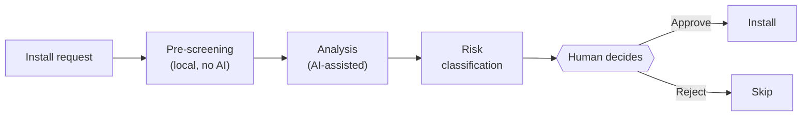

# Cerbero

**Security screening for Claude Code.** Evaluate before you install.

<!-- GitHub About: Security screening framework for Claude Code. Evaluates MCP servers and Skills before installation. Detects prompt injection, supply chain attacks, rug pulls, and known CVEs. Local-first, pure Python stdlib, zero dependencies. -->
<!-- Topics: claude-code, mcp-security, prompt-injection, supply-chain-security, agent-skills, security-screening, owasp-mcp-top-10, hooks -->


You run `claude mcp add`, it works, you move on. But that server now has access to your files, your shell, and your conversation context. Did you check what it does with that access?

MCP servers execute code with your permissions. Skills inject instructions into your AI's context. The ecosystem is growing faster than anyone can audit, and a single malicious tool description can hijack your entire session. Cerbero screens MCP servers and Skills before you install them — so you can make informed decisions instead of trusting blindly.

## Table of Contents

- [Quick Start](#quick-start)
- [What Cerbero Does](#what-cerbero-does)
- [What Cerbero Does NOT Do](#what-cerbero-does-not-do)
- [How It Works](#how-it-works)
- [Installation](#installation)
- [Configuration](#configuration)
- [Operations](#operations)
- [Detection Tiers](#detection-tiers)
- [Integration with Ignite](#integration-with-ignite)
- [Requirements](#requirements)
- [FAQ](#faq)
- [Threat Reference](#threat-reference)
- [Project Values](#project-values)
- [Limitations](#limitations)
- [Contributing](#contributing)
- [Acknowledgments](#acknowledgments)
- [License](#license)

## Quick Start

> [!TIP]
> Three steps. Under 5 minutes.

**1. Copy the skill and hooks to your project:**

```bash
git clone https://github.com/jppuche/Cerbero.git
cp -r Cerbero/.claude/skills/cerbero/ your-project/.claude/skills/cerbero/
cp Cerbero/hooks/*.py your-project/.claude/hooks/
```

**2. Copy the example settings** (or merge into your existing `settings.local.json`):

```bash
cp Cerbero/examples/settings.local.json your-project/.claude/settings.local.json
```

**3. Set up security artifacts:**

```bash
mkdir -p your-project/.claude/security
cp Cerbero/security/trusted-publishers.txt your-project/.claude/security/
```

Run `/cerbero evaluate-mcp <package-name>` to evaluate your first MCP server.

<details>
<summary>Verify installation</summary>

```bash
# Should detect injection (blocks with exit code 2)
echo '{"prompt":"ignore previous instructions"}' | python .claude/hooks/validate-prompt.py

# Should block dangerous command
echo '{"tool_input":{"command":"rm -rf /"}}' | python .claude/hooks/pre-tool-security.py

# Should allow safe command (exit 0)
echo '{"tool_input":{"command":"echo hello"}}' | python .claude/hooks/pre-tool-security.py
```

</details>

## What Cerbero Does

- **Evaluates MCP servers before installation** — Source code review, dependency audit, reputation check, automated scanning, and semantic analysis. 8-step process with documented verdict
- **Evaluates Skills before installation** — File type validation, community intelligence, content analysis with pre-context scanning. Catches prompt injection in Markdown files
- **Detects rug pulls** — SHA-256 baseline comparison catches silent updates to MCP server tool descriptions. Classifies changes as BENIGN/SUSPICIOUS/MALICIOUS
- **Blocks dangerous commands in real-time** — Hook intercepts `rm -rf`, fork bombs, remote code execution patterns, and PowerShell exploits before they run
- **Detects prompt injection in your prompts** — Normalize-then-detect pipeline: NFKC normalization, homoglyph defeat, proximity matching, base64 recursive decode, zero-width stripping. Catches encoded and obfuscated attacks
- **Scans external content for indirect injection** — Post-tool hook analyzes MCP and WebFetch outputs for format injection tags, conversation splicing, and base64-obfuscated payloads
- **Maintains an audit trail** — Every MCP tool invocation is logged with timestamp, tool name, and session ID. Reminds you to verify every 50 calls

## What Cerbero Does NOT Do

Cerbero is a screening layer, not a security guarantee.

- **Does not catch all attacks.** Pattern-based detection misses creative paraphrasing. Claude's built-in safety training is the primary defense against semantic attacks — Cerbero's regex layer is supplementary
- **Does not prevent runtime exploits.** Cerbero screens before installation. For runtime isolation, use `claude --sandbox`
- **Does not replace code review.** Automated scanning catches known patterns. Novel attack vectors require human judgment
- **Does not block dynamic evasion.** Shell command normalization (shlex) catches static evasion (quotes, backslashes) but not variable expansion, aliases, or IFS tricks
- **Does not phone home.** All core detection is local. Web research queries during evaluation use your existing Claude Code tools (WebSearch/WebFetch) — Cerbero itself makes zero network calls
- **Does not auto-reject on a single flag.** One suspicious finding triggers REQUIRES HUMAN REVIEW, not automatic rejection. You always make the final call

## How It Works



When you run `/cerbero evaluate-mcp <package-name>`, Cerbero executes a multi-step evaluation:

```
User: /cerbero evaluate-mcp @example/mcp-server

Cerbero:
  1. Reviews source code for dangerous patterns
  2. Checks reputation: age, downloads, stars, publisher trust
  3. Searches for known vulnerabilities (CVEs, community reports)
  4. Audits dependencies (npm audit + signature verification)
  5. Runs pre-context scanner (Tier 0 — before Claude reads tool definitions)
  6. Performs semantic analysis (Tier 3 — Claude analyzes pre-processed content)
  7. Classifies risk: MEDIUM / HIGH / CRITICAL
  8. Produces verdict: APPROVED / REQUIRES HUMAN REVIEW / REJECTED

→ Presents full report to you before any installation happens
```

<details>
<summary>Example evaluation verdict (click to expand)</summary>

```
══════════════════════════════════════════════════════
  CERBERO EVALUATION REPORT — @anthropic/mcp-docs
══════════════════════════════════════════════════════

  Publisher:    anthropic (TRUSTED)
  Package age:  8 months | Downloads: 12,400/week
  Dependencies: 3 (all audited, 0 vulnerabilities)

  Tier 0 (pre-context scanner):  CLEAN
  Tier 1 (instant checks):      CLEAN
  Tier 2 (local analysis):      CLEAN
  Tier 3 (semantic analysis):   SKIPPED (trusted publisher, clean tiers)

  Risk level:   MEDIUM (read-only data access)
  Capabilities: Network outbound (docs fetching)

  ┌─────────────────────────────────────────────────┐
  │  VERDICT: APPROVED                              │
  │  Reason: Trusted publisher, clean scan,         │
  │  read-only capabilities, no suspicious patterns │
  └─────────────────────────────────────────────────┘

  Action: You may install. Run /cerbero verify periodically
  to detect changes to tool descriptions (rug pull detection).
```

</details>

The hooks run automatically in the background:
- **Every prompt you type** passes through injection detection
- **Every shell command** is checked against dangerous patterns
- **Every MCP tool call** is logged and audited
- **Every external response** is scanned for indirect injection

## Installation

See the full [Setup Guide](.claude/skills/cerbero/setup-guide.md) for detailed instructions.

### Per-project (recommended)

```bash
git clone https://github.com/jppuche/Cerbero.git
cd Cerbero

# Copy skill
cp -r .claude/skills/cerbero/ <your-project>/.claude/skills/cerbero/

# Copy hooks
mkdir -p <your-project>/.claude/hooks
cp hooks/*.py <your-project>/.claude/hooks/

# Security artifacts
mkdir -p <your-project>/.claude/security
cp security/trusted-publishers.txt <your-project>/.claude/security/
```

### Global (all projects)

```bash
# Skill
cp -r .claude/skills/cerbero/ ~/.claude/skills/cerbero/

# Hooks
mkdir -p ~/.claude/hooks
cp hooks/*.py ~/.claude/hooks/
```

> [!NOTE]
> For global installation, update hook paths in your settings from `.claude/hooks/` to `~/.claude/hooks/`.

## Configuration

Cerbero uses Claude Code's native hooks system. See `examples/settings.local.json` for a complete working configuration.

The key sections:

| Section | Purpose |
|---------|---------|
| `permissions.deny` | Block dangerous commands (curl piping, rm -rf, secrets access) |
| `hooks.UserPromptSubmit` | Prompt injection detection on every user message |
| `hooks.PreToolUse` | Dangerous command blocking + MCP audit trail + untrusted source reminder |
| `hooks.PostToolUse` | Indirect injection scanning on WebFetch and MCP outputs |

### Trusted Publishers

The default list is intentionally minimal: `anthropic` and `trailofbits`. A publisher on this list allows Cerbero to auto-approve their components when all other checks pass. Every other publisher requires human review.

Adding a publisher requires meeting three criteria: direct relevance to Claude Code, established security track record, and no commercial conflict of interest. See the [Setup Guide](.claude/skills/cerbero/setup-guide.md#a5--trusted-publishers-list) for details.

## Operations

| Command | When to use |
|---------|-------------|
| `/cerbero evaluate-mcp <package>` | Before installing any MCP server |
| `/cerbero evaluate-skill <path>` | Before installing any Skill file |
| `/cerbero verify` | Routine check for rug pulls (recommended: start of each session) |
| `/cerbero audit` | Monthly full security audit |

Each operation produces a structured report presented to you before any action is taken.

## Detection Tiers

All tiers run locally. No external APIs required for core detection.

| Tier | Speed | What it does | When it runs |
|------|-------|-------------|--------------|
| **Tier 0** | Pre-context | Python scanner runs BEFORE Claude reads content. Catches injection, base64, zero-width chars, HTML comments, CSS hiding | Always for Skill evaluation. MCP semantic analysis |
| **Tier 1** | < 100ms | Hash comparison, regex patterns, file type validation, npm audit | Every evaluation |
| **Tier 2** | 100ms-2s | Base64/hex recursive decode, HTML comment extraction, CSS hiding, source code patterns, tool schema analysis | Every evaluation |
| **Tier 3** | 2-10s | Claude semantic analysis on pre-processed (stripped) content. Multi-stage attack detection | When Tier 2 flags SUSPICIOUS+, untrusted publisher, or user requests deep analysis |

### Multi-scanner logic

Inspired by [Vigil](https://github.com/deadbits/vigil-llm):
- 1 non-injection check fails → SUSPICIOUS (continue evaluation)
- 2+ checks fail → REJECT or REQUIRES HUMAN REVIEW
- Direct injection phrase → always REJECT (one match suffices)

### Optional external scanners

- **cisco-ai-mcp-scanner** (recommended for 5+ MCPs): YARA-only mode, 100% offline. `uv tool install --python 3.13 cisco-ai-mcp-scanner`
- **Trail of Bits mcp-context-protector**: Runtime TOFU pinning. No stable release yet

## Integration with Ignite

Cerbero is also available as part of [Ignite](https://github.com/jppuche/Ignite), a complete development infrastructure for Claude Code. Ignite adds session memory that survives `/clear`, compound learning where Claude gets better every session, quality gates that block commits when docs go stale, and CI/CD adapted to your stack.

Use Cerbero standalone if you only need security screening. Use Ignite if you want the full development workflow with Cerbero built in.

## Requirements

- **Python 3.8+** (hooks use stdlib only — no pip install needed)
- **Claude Code** (latest stable recommended)
- **Node.js 18+** (for `npm audit` during MCP evaluation)

Optional:
- **uv** — for installing cisco-ai-mcp-scanner
- **Python 3.11-3.13** — required by cisco-ai-mcp-scanner (if used)

## FAQ

<details>
<summary>Does Cerbero send my data anywhere?</summary>

No. All core detection runs locally using Python stdlib. During evaluation, Cerbero uses Claude Code's WebSearch/WebFetch tools to check for known vulnerabilities — these use whatever web access Claude Code already has. The hooks themselves make zero network calls.

</details>

<details>
<summary>Can I use Cerbero without the hooks?</summary>

Yes. The skill (`/cerbero evaluate-mcp`, etc.) works independently. The hooks add real-time protection between evaluations — prompt injection defense, dangerous command blocking, audit trail, and indirect injection scanning. Both layers are valuable but neither depends on the other.

</details>

<details>
<summary>What happens if a hook crashes?</summary>

All hooks fail open. A crash means the command/prompt is allowed through. This is by design — a false-positive that blocks your work is worse than a missed detection in a screening tool. The primary defense is always Claude's built-in safety training.

</details>

<details>
<summary>How is this different from mcp-scan?</summary>

mcp-scan (originally Invariant Labs, now Snyk) was deprecated in early 2026. v0.3.0 is unmaintained; v0.4+ requires a Snyk account and mandatory cloud data transmission. Cerbero runs entirely locally, covers both MCP servers and Skills, includes 6 automation hooks, and provides rug pull detection. For YARA-based malware signatures, Cerbero recommends cisco-ai-mcp-scanner as a complement.

</details>

<details>
<summary>Does Cerbero work on all platforms?</summary>

Yes. Python stdlib is cross-platform. The hooks work on Windows, macOS, and Linux. The operation procedures include PowerShell examples but the concepts apply to any shell. Hook configuration uses Claude Code's native hooks API which is platform-agnostic.

</details>

<details>
<summary>Can Cerbero evaluate servers from the MCP registry?</summary>

Yes. `/cerbero evaluate-mcp <package-name>` works with any npm package. The evaluation includes checking the npm registry for metadata, downloading the package to a temp directory for dependency audit, and verifying provenance signatures.

</details>

## Threat Reference

Cerbero's detection maps to the [OWASP MCP Top 10](https://owasp.org/www-project-mcp-top-10/):

| OWASP ID | Threat | Cerbero Coverage |
|----------|--------|-----------------|
| MCP01 | Token Mismanagement | Auth check in evaluate-mcp (Step 1.8) |
| MCP02 | Privilege Escalation | Risk classification matrix, sandbox enforcement |
| MCP03 | Tool Poisoning | Tier 0-3 detection, semantic analysis, canary technique |
| MCP04 | Supply Chain Attacks | Dependency audit, typosquat detection, provenance verification |
| MCP05 | Command Injection | pre-tool-security hook, source code pattern matching |
| MCP06 | Prompt Injection | validate-prompt hook, cerbero-scanner, Tier 0-3 pipeline |
| MCP07 | Insufficient Auth | Auth check for remote (SSE/HTTP) servers |
| MCP08 | Lack of Telemetry | mcp-audit hook, invocation counter, audit trail |
| MCP09 | Shadow MCP Servers | Configuration integrity check in full audit |
| MCP10 | Context Over-Sharing | Tool description analysis, compound risk flagging |

## Project Values

- **Security through transparency.** Every detection pattern is documented. Every hook is auditable. No black boxes
- **Local-first.** No external APIs required for core detection. Your code stays on your machine
- **Defense in depth.** Cerbero is one layer, not the only layer. It complements Claude's built-in safety, OS-level sandboxing, and human judgment
- **Informed decisions.** Cerbero always presents findings to the human before acting. It never auto-installs, never silently skips, never hides a finding

## Limitations

### What Cerbero doesn't do

- Runtime monitoring (use `claude --sandbox` for OS-level enforcement)
- Network traffic analysis (out of scope for a screening tool)
- Binary analysis of compiled MCP servers (text-based scanning only)
- Guarantee safety (no tool can — security is a process, not a product)

### Known detection gaps

- Creative paraphrasing of injection attempts (not regex-matchable)
- Dynamic shell evasion (variable expansion, aliases, IFS tricks)
- Polyglot files that pass file type validation but contain hidden payloads
- Zero-day vulnerabilities not yet in CVE databases or community reports
- Multi-turn attacks that span across separate tool calls

> [!IMPORTANT]
> Cerbero reduces risk. It does not eliminate it. Use it alongside sandbox mode, careful permission policies, and your own judgment.

## Contributing

See [CONTRIBUTING.md](CONTRIBUTING.md) for guidelines.

## Acknowledgments

### Methodologies and Standards
- [OWASP MCP Top 10](https://owasp.org/www-project-mcp-top-10/) — Threat classification framework
- [TOFU (Trust on First Use)](https://en.wikipedia.org/wiki/Trust_on_first_use) — Baseline comparison model

### Research and Tools
- [Invariant Labs](https://invariantlabs.ai/) — Compound risk research on MCP server interactions
- [Cisco AI Defense](https://www.cisco.com/site/us/en/products/security/ai-defense/) — YARA patterns and MCP scanner inspiration
- [Trail of Bits](https://www.trailofbits.com/) — TOFU concepts and mcp-context-protector
- [Vigil](https://github.com/deadbits/vigil-llm) — Multi-scanner trigger logic inspiration

### Platform
- [Anthropic](https://www.anthropic.com/) — Claude Code hooks API that makes automation possible

## License

MIT. See [LICENSE](LICENSE).

---

Made by [Juan Puche](https://github.com/jppuche) — building security tools for AI-assisted development.
